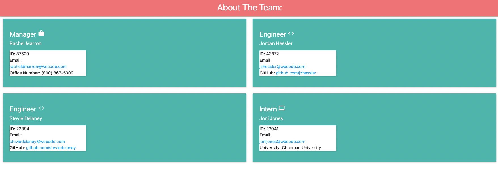

# Team Profile Generator

## Link to deployed application 
<a href="https://racheldmarron.github.io/generate-your-team/">https://racheldmarron.github.io/generate-your-team/</a>  
<a href="https://youtu.be/py8v_qUVuSE">https://youtu.be/py8v_qUVuSE</a>

## Overview 
You are able to build your team of Manager, Engineers, and Interns on the Node.js command line. You will then be taken to an web page that is populated by the information you put in about your team, including ID, email, office number, github, and uinversity attended. 

## Summary of My Task & User Story 
This assigment had a user story of: AS A manager, I WANT to generate a webpage that displays my team's basic info, SO THAT I have quick access to their emails and GitHub profiles. 

The Acceptance Criteria included: 
<ul><li>User is prompted to enter their team's information on the command line</li>
<li>An HTML page is generated that displays a nicely formatted team roster</li>
<li>Email and GitHub links are opened when clicked on</li>
<li>User in prompted to add an engineer, intern, maanger, or select "finished building my team"</li>
<li>When they are complete entering the team's information on the command line, the HTML is generated with correct information</li></ul>

## How This Was Acheived
<ul>
<li>4 separate js files were created in the lib folder that included intern, engineer, manager, employee</li>
<li>The 3 team members js files fed into the employee.js file as employee is the parent.</li>
<li>A generate-site.js was created that would generate the HTML based on the user's inputs on the command line</li>
<li>An app.js file was created that housed the functionality to run node on the command line, generate the questions, and create the team</li>
<li>An index.html and style.css file were created that housed the front-end styling of the webpage users can view their team</li>
<li>Finally, test.js was created to run automated tests for the employee parent and ensure all criteria was passed.</li>
  </ul>

## Publishing to GitHub
<ul>
  <li>I created a new repository on my GitHub account titled "generate-your-team"</li>
  <li>I pulled the repository onto my computer and committed changes to GitHub as necessary</li>
</ul>
   

## Video 
<iframe width="560" height="315" src="https://www.youtube.com/embed/py8v_qUVuSE" title="YouTube video player" frameborder="0" allow="accelerometer; autoplay; clipboard-write; encrypted-media; gyroscope; picture-in-picture" allowfullscreen></iframe>

## Contributors

- N/A

## License

This application is covered under MIT License    

- - -

© 2021 Rachel Delaney Marron, Inc. All Rights Reserved.
